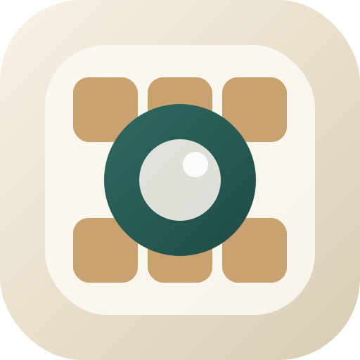
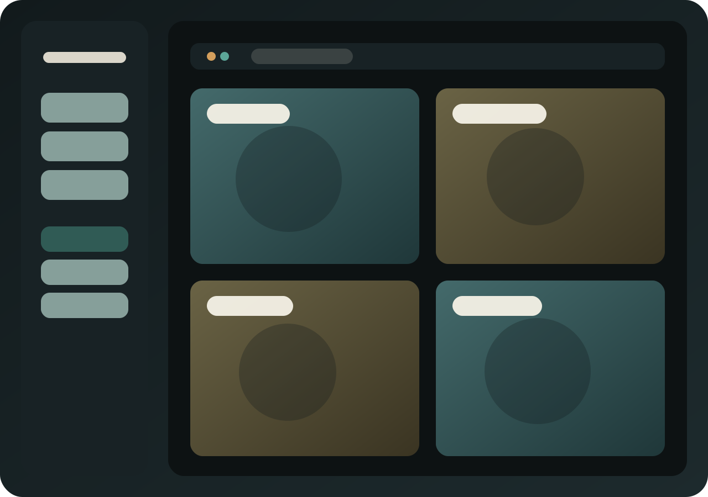
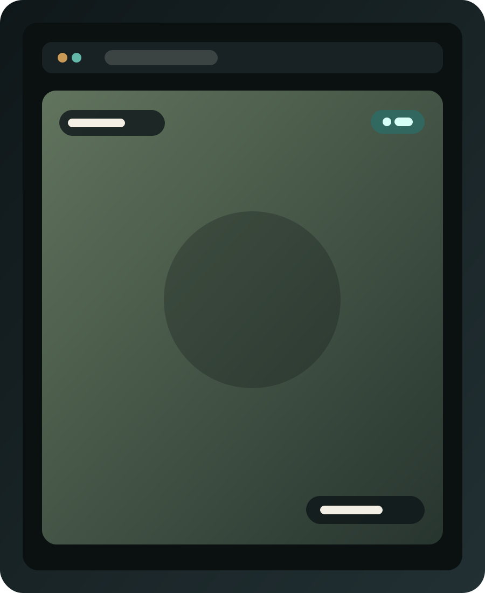
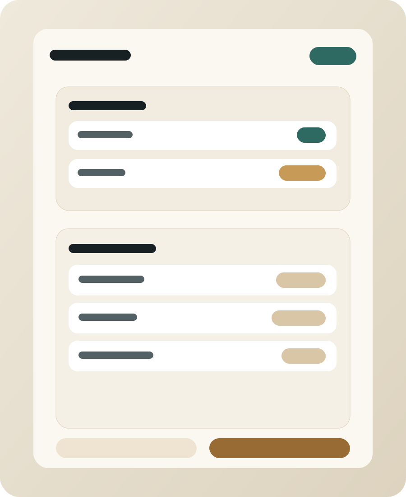

<div align="center">

<picture>
  <source srcset="docs/icon-dark.svg" media="(prefers-color-scheme: dark)">
  <source srcset="docs/icon-light.svg" media="(prefers-color-scheme: light)">
  
</picture>

## Security Center

Native camera monitoring for macOS and iOS.

[Website](docs/index.html) ·
[Support](docs/Support.html) ·
[Privacy](docs/PrivacyPolicy.html)

</div>

<p align="center">
  <a href="docs/preview-grid.svg"></a>
  <a href="docs/preview-camera.svg"></a>
  <a href="docs/preview-settings.svg"></a>
</p>

Security Center is a SwiftUI app for monitoring Reolink cameras and generic RTSP streams from one place. It supports single-camera viewing, saved grids, per-camera settings, sidebar availability, JSON import and export, and quiet hours that black out the screen and pause camera traffic.

## Features

- Reolink Camera and Generic RTSP Stream support
- Reolink JPG polling and RTSP live video modes
- Saved custom grids with camera assignment
- Sidebar availability checks for enabled cameras
- Quiet hours that black out the screen and pause polling, streaming, and probing
- RTSP mute control
- Per-camera display name overlays and positioning
- JSON import and export using the app's persisted model
- Shared SwiftUI app for macOS and iOS with platform-specific settings flows

## Camera Modes

| Type | Feed Options |
| --- | --- |
| Reolink Camera | `Reolink JPG`, `RTSP` |
| Generic RTSP Stream | `RTSP` |

## Platforms

- macOS 26.2 or later
- iOS 26.2 or later
- Built with SwiftUI and `VLCKitSPM`

## What It Stores

Security Center stores its app state locally in `UserDefaults`, including:

- Cameras
- Saved grids
- Grid assignments
- Grid picture style
- Selected sidebar item
- Quiet hours

Import and export use the same JSON payload shape as the app's stored model.

## Build From Source

Open the project in Xcode:

```bash
open "Security Center.xcodeproj"
```

Unsigned command-line builds:

```bash
env HOME=$PWD/.home \
CLANG_MODULE_CACHE_PATH=$PWD/.cache/clang/ModuleCache \
SWIFTPM_MODULECACHE_OVERRIDE=$PWD/.cache/org.swift.swiftpm \
CFFIXED_USER_HOME=$PWD/.home \
xcodebuild -project "Security Center.xcodeproj" \
  -scheme "Security Center" \
  -destination "generic/platform=macOS" \
  -clonedSourcePackagesDirPath ".sourcepackages" \
  -derivedDataPath ".derivedData" \
  CODE_SIGNING_ALLOWED=NO \
  CODE_SIGNING_REQUIRED=NO \
  build
```

```bash
env HOME=$PWD/.home \
CLANG_MODULE_CACHE_PATH=$PWD/.cache/clang/ModuleCache \
SWIFTPM_MODULECACHE_OVERRIDE=$PWD/.cache/org.swift.swiftpm \
CFFIXED_USER_HOME=$PWD/.home \
xcodebuild -project "Security Center.xcodeproj" \
  -scheme "Security Center" \
  -destination "generic/platform=iOS" \
  -clonedSourcePackagesDirPath ".sourcepackages" \
  -derivedDataPath ".derivedData-ios" \
  CODE_SIGNING_ALLOWED=NO \
  CODE_SIGNING_REQUIRED=NO \
  build
```

## Support

Support details live in [docs/Support.html](docs/Support.html).

## Privacy

Privacy details live in [docs/PrivacyPolicy.html](docs/PrivacyPolicy.html).
